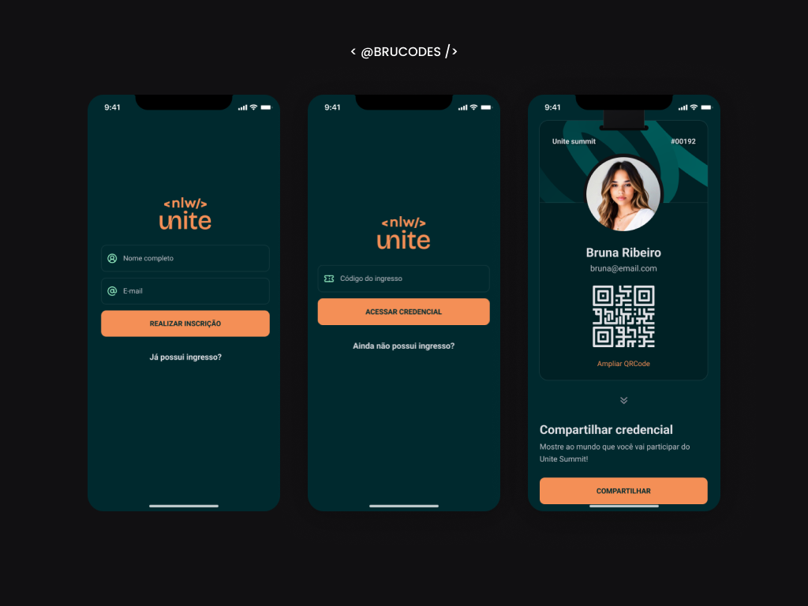

## PassIn App 🔖

Registered participants can generate a credential for check-in on the event day, and the system scans their credential for event entry.

## Technologies

- `React Native`
- `TypeScript`
- `Tailwind CSS`
- `SQLite`
- `Expo`
- `Expo Go`
- `Expo Router`
- `React Native QRCode SVG`
- `React Native Reanimated`
- `Moti`
- `Zustand`

## Features

Here's what you can do with PassIn App:

- **User Registration for Events:** Allow users to register for specific events by providing necessary information and personalized details.

- **Profile Picture Customization:** Let participants customize their profile pictures for a more personalized experience.

- **Generation of Unique QR Codes:** Each participant receives a unique QR code for easy and secure access to the event.

- **Automatic Login:** If a user is already registered, the system will save their login information for easier future access.

- **Account Deletion Option:** Users have the option to delete their accounts if desired, with all associated information removed from the system.

- **Zoom for QR Code:** An option to zoom in on the QR code to increase visibility, making it more readable and accessible for all participants.

## Running the Project

To run the project in your local environment, follow these steps:

*Dependencies: Node.js, Git, Expo Go, Android Emulator (Android Studio)*

1. Clone the repository to your local machine.
2. Run `npm install` in the project directory to install the required dependencies.
3. Run `npm i` to get the node_modules.
4. Run `npm expo start` to get the project started.
5. Open Expo Go app on your iOS or Android device.
6. Use your mobile device's camera to scan the QRcode.

## Business Rules

- [x] Participants can only register for an event once.
- [x] Participants can only register for events with available slots.
- [x] Participants can only check-in for an event once.

## Non-functional Requirements

- [x] Event check-in will be done through a QRCode.

## Preview

<h1 align="center">
  
</h1>
